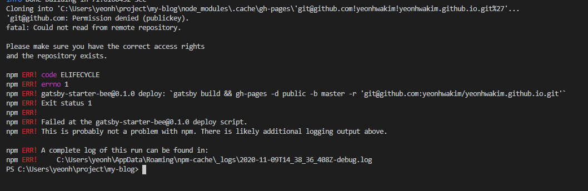
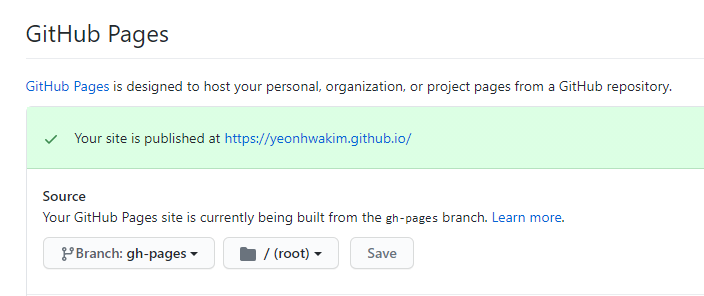

오늘 드디어 블로그를 만들게 되었다.<br>
생각보다 많은 우여곡절이 있어서 첫번째 포스팅에 적어보려고한다.🚗🚓🚕

💦 [템플릿 고르기](#template) <br>
💦 [배포방법](#deploy) <br>
💦 [permission denied?](#denied) <br>
💦 [github action](#gitaction) <br>

<span id="template"></span>

### 🚒 템플릿 고르기 Jekyll vs Gatsby

선택 장애가 있어 템플릿을 고를 때부터 머리가 아팠다.
거두절미하고 Jekyll `minimal-mistakes` 와 Gatsby `gatsby-starter-bee`가 최종 선택지였다.

결국 `gatsby-starter-bee`를 선택하게 되었다.

SPA고 pc는 물론 mobile 반응형 화면까지 깔끔하다.
그리고 배포도 간단해보였다.

<span id="deploy"></span>

### 🚒 배포방법 Publish with netlify vs github pages

[gatsby-starter-bee](https://github.com/JaeYeopHan/gatsby-starter-bee#-gatsby-config) 에서 배포는 netlify와 github pages두가지 배포방법을 제시해놓았다.

[netlify](https://blog.outsider.ne.kr/1417)는 서버 없이 쉽게 정적페이지를 배포해주는 도구라고한다.

깃허브 페이지(GitHub Pages)는 깃허브에서 제공하는 정적 사이트 호스팅 서비스이다.

나는 GitHub Pages를 통해 배포를 해보았다.

<span id="denied"></span>

### 🚒 permission denied

gatsby-starter-bee에서는 github pages로 배포하는 방법을 아래 스크립트로 안내해줬다.

```js
"scripts": {
  "deploy": "gatsby build && gh-pages -d public -b master -r 'git@github.com:${your github id}/${github page name}.github.io.git'"
}

```



<br>
하지만... 계속 permission denied 이라고 떴다.
<br>
결국 git action으로 github pages를 배포하게 되었다.
<span id="gitaction"></span>

### 🚒 github action으로 gh-pages 배포하기

최근에 git action을 통해 배포한 경험이 있어서 git action을 통해 github pages를 배포하기로 했다.<br><br>
main 브런치에는 기존 폴더들이, public 폴더에 있는 빌드된 파일들이 gh-pages 브런치에 배포되도록 했다.

✔ main 브런치가 push 될 때 git action이 실행되도록 했다.

```yml
on:
  push:
    branches:
      - main
```

✔ 기본 root를 gh-pages브런치로 설정 해놔야 한다.


✔ [gitflows 참고 사항은 여기에!](https://github.com/peaceiris/actions-gh-pages)
